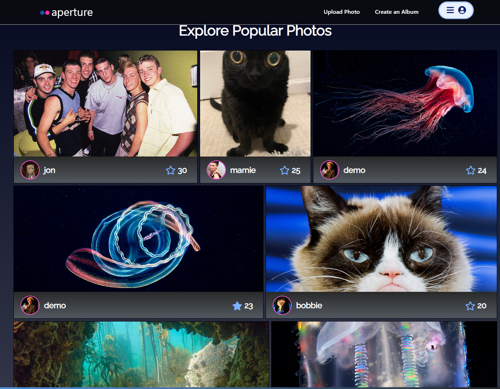
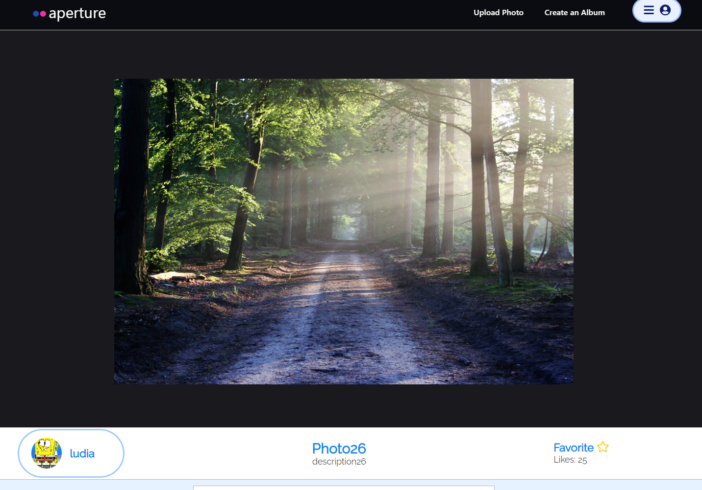
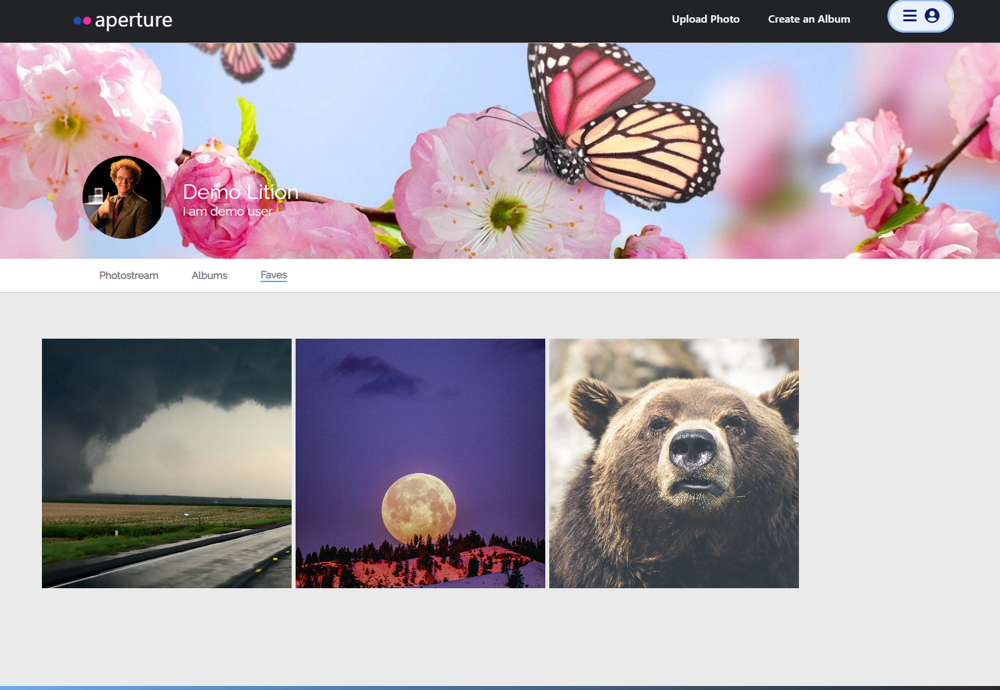

# Aperture

Inspired by Flickr, Aperture is your new space for photo-sharing. Upload, curate albums, and connect with a vibrant community. Dive in and let your creativity shine.

Checkout out [Aperture](https://aperture-6ohc.onrender.com/) and find your inspiration.

## Index

[MVP Feature List](https://github.com/JonEzana/aperture_project/wiki/Features) |
[Database Scheme](https://github.com/JonEzana/aperture_project/wiki/DB-Schema-Diagram-&-Schema) |
[User Stories](https://github.com/JonEzana/aperture_project/wiki/User-Stories) |
[Store Shape](https://github.com/JonEzana/aperture_project/wiki/Store-Shape) |

## Technologies Used

## Landing Page

## Photo Detail Page

## User Profile Page

## Getting started
1. Clone this repository:
    * `https://github.com/JonEzana/aperture_project.git`

2. Install dependencies into the Backend by running the following:
    * `pipenv install`

3. Install dependencies into the Frontend by cd into `react-app` and running the following:
    * `npm install`

4. Create a **.env** file using the **.envexample** provided

5. Set up your database with information from your .env and then run the following to create your database, migrate, and seed:
    * `pipenv run flask db migrate`
    * `pipenv run flask db upgrade`
    * `pipenv run flask seed all`

6. Start the app for backend using:
    * `pipenv run flask run`

7. Start the app for frontend by cd into `react-app` and running:
    * `npm start`

8. Now you can use the `Demo User` button to log in or Create an account

***

# Features

## Photos
Logged-in Users can
* post a Photo
* read/view other users' photos
* update their photos
* delete their photos

## Albums
Logged-in Users can
* create an Album
* read/view other users' albums
* update their albums
* delete their albums

## Comments
Logged-in Users can
* post a comment for a photo under the photo detail page
* read/view other users' comments under a photo detail page
* delete a comment post by the logged-in user

## Favorites
Logged-in Users can
* favor/unfavor a photo by clicking the star icon on home page or photo detail page
* read/review other users' favorite photos by checking the users profile `Faves` section

# Connect
* Colin Sung [GitHub](https://github.com/colinsung0714) [LinkedIn](https://www.linkedin.com/in/colin-sung-187a57103/)
* Ludia Park [GitHub](https://github.com/lypark5) [LinkedIn](https://www.linkedin.com/in/ludia-park-172496293/)
* Jon Ezana [GitHub](https://github.com/JonEzana) [LinkedIn](https://www.linkedin.com/in/jon-ezana-798a8419b/)
* Vivian Li [GitHub](https://github.com/Vivi355) [LinkedIn](https://www.linkedin.com/in/liqin-li-880646144/)
